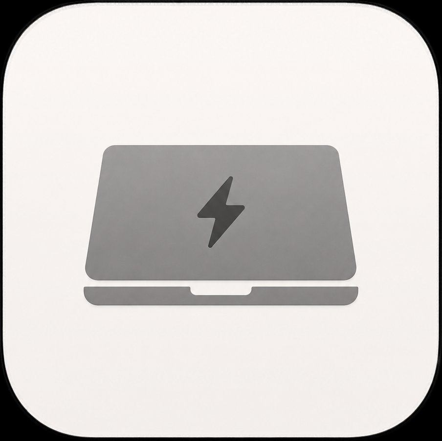

# Insomne 🌙

<p align="center">
  
</p>

<p align="center">
  macOS menu bar app that keeps your Mac awake with the lid closed.
</p>

---

## English

### What it does

Insomne sits in your menu bar and lets you keep your Mac running with the lid closed — no Display Sleep, no system sleep. One click to enable, one click to disable.

- **⚡ Active** — your Mac stays on with the lid closed
- **⚡̶ Inactive** — normal macOS sleep behaviour

### Install

You need Xcode Command Line Tools. If you don't have them, run this first:

```bash
xcode-select --install
```

Then install Insomne:

```bash
git clone https://github.com/Juty4/Insomne.git
cd Insomne
bash build.sh
```

That's it. The app installs itself in `/Applications` and opens automatically.

> **macOS blocks the app?** Run this in Terminal and try again:
> ```bash
> xattr -cr /Applications/Insomne.app && open /Applications/Insomne.app
> ```

### Create a DMG

To generate a DMG file you can share with others:

```bash
bash make_dmg.sh
```

This creates `Insomne-1.0.dmg` in the project folder. The recipient will need to run this after dragging the app to Applications:

```bash
xattr -cr /Applications/Insomne.app && open /Applications/Insomne.app
```

### Uninstall

```bash
curl -fsSL https://raw.githubusercontent.com/Juty4/Insomne/main/uninstall.sh | bash
```

---

## Español

### Qué hace

Insomne vive en tu barra de menú y te permite mantener el Mac encendido con la tapa cerrada — sin que entre en reposo. Un clic para activarlo, otro para desactivarlo.

- **⚡ Activo** — el Mac se mantiene encendido con la tapa cerrada
- **⚡̶ Inactivo** — comportamiento normal de macOS

### Instalar

Necesitas las Xcode Command Line Tools. Si no las tienes, ejecuta esto primero:

```bash
xcode-select --install
```

Luego instala Insomne:

```bash
git clone https://github.com/Juty4/Insomne.git
cd Insomne
bash build.sh
```

Listo. La app se instala sola en `/Applications` y se abre automáticamente.

> **¿macOS bloquea la app?** Ejecuta esto en Terminal e inténtalo de nuevo:
> ```bash
> xattr -cr /Applications/Insomne.app && open /Applications/Insomne.app
> ```

### Crear un DMG

Para generar un DMG que puedas compartir con otros:

```bash
bash make_dmg.sh
```

Esto crea `Insomne-1.0.dmg` en la carpeta del proyecto. El destinatario deberá ejecutar esto tras arrastrar la app a Aplicaciones:

```bash
xattr -cr /Applications/Insomne.app && open /Applications/Insomne.app
```

### Desinstalar

```bash
curl -fsSL https://raw.githubusercontent.com/Juty4/Insomne/main/uninstall.sh | bash
```

---

## Requirements

- macOS 13 Ventura or later
- Apple Silicon or Intel
- Xcode Command Line Tools
